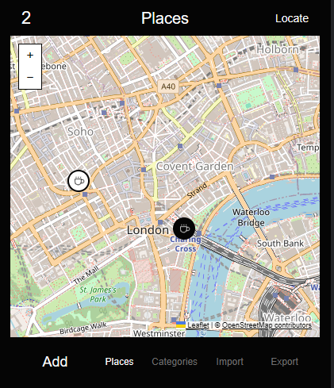

# Places

Places is a minimal monochrome saved-places tool designed as an early Light Phone III concept.

The current version includes both a browser prototype and a fast Expo WebView APK wrapper for testing on an Android-layer Light Phone III.



## What It Does

- Saves places with a name, optional note, latitude, longitude, and tag
- Shows saved places on a Leaflet map using OpenStreetMap tiles
- Requests device location on demand and can save it as a place
- Imports Google Maps style exports from JSON, GeoJSON, KML, and CSV files
- Stores data locally in the browser
- Avoids navigation, feeds, ads, and tracking

## Run

Open `index.html` in a browser.

## Android APK Test

The local APK wrapper is defined by `App.tsx`, `app.json`, `package.json`, and `src/webContent.ts`.

See `docs/local-apk.md`.

The first successful Light Phone III test used:

- connected device: `LP3LHMA521400271`
- package: `com.dan.places`
- APK: `C:\tmp\places-build\android\app\build\outputs\apk\debug\app-debug.apk`
- ADB reverse: `tcp:8081 tcp:8081`
- Metro project path: `C:\tmp\places-build`

Useful commands:

```powershell
$adb = "C:\Users\Dan\AppData\Local\Android\Sdk\platform-tools\adb.exe"
& $adb devices -l
& $adb reverse tcp:8081 tcp:8081
& $adb install -r "C:\tmp\places-build\android\app\build\outputs\apk\debug\app-debug.apk"
& $adb shell monkey -p com.dan.places 1
```

The browser prototype loads Leaflet from a CDN and map tiles from OpenStreetMap, so the real map needs internet access. If either fails, the app falls back to a simple local map sketch so saved coordinates are still visible.

For GPS testing, use the `Locate` action. Some browsers restrict location access on `file://`; if the prompt does not appear, run a local server and open `http://localhost:8000`.

## Map Approach

For quick testing:

- Leaflet renders the interactive map
- OpenStreetMap provides the tile images
- Places are stored locally and drawn as numbered markers
- Device location is shown as a dot only after the user presses `Locate`

For a real Light Phone III release, use one of these approaches:

- Online tiles from a proper provider with attribution and usage terms
- Offline tiles packaged with the app for a small city/region
- A vector/PMTiles style map if the SDK supports it

Google Maps import does not require the Google Maps API because exported files already contain place names and coordinates.

## Light Phone III Notes

Light announced its LightOS Developer Program in April 2026 with SDK invitations starting in May 2026. The SDK is expected to support APK-based tools, an emulator, and a future curated Tool Library. Until the SDK is available, this repository keeps the product logic, data model, and monochrome interface small enough to migrate cleanly.

## Data Import

Supported import formats:

- Google Takeout / Maps GeoJSON
- Google My Maps KML
- CSV with columns like `name`, `latitude`, `longitude`, `note`, `tag`
- JSON arrays using fields such as `title`, `name`, `lat`, `lng`, `latitude`, `longitude`

## Design Principles

- Store places, do not route
- Keep maps quiet and readable
- Work offline after loading
- Make every action intentional
- Prefer plain files over accounts
